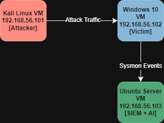
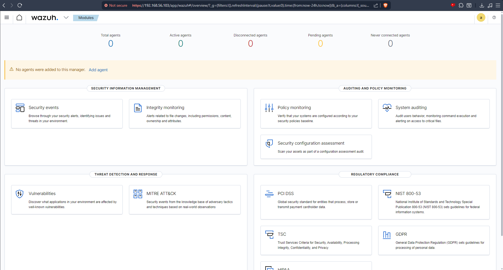
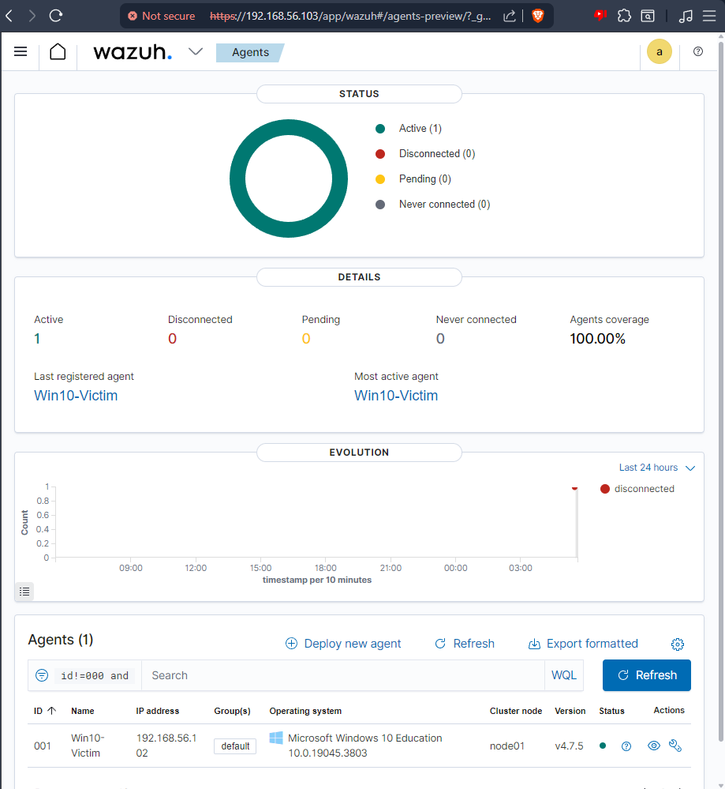
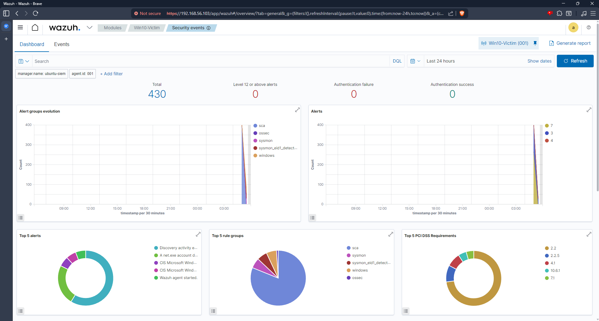
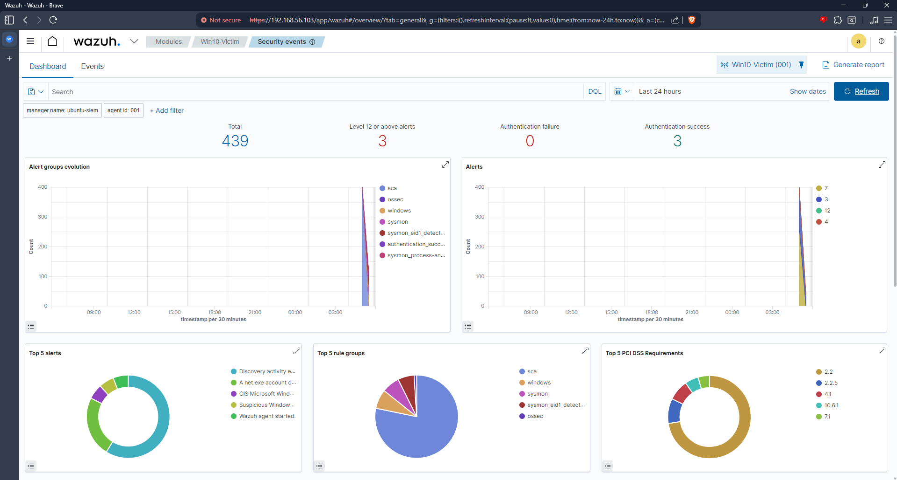
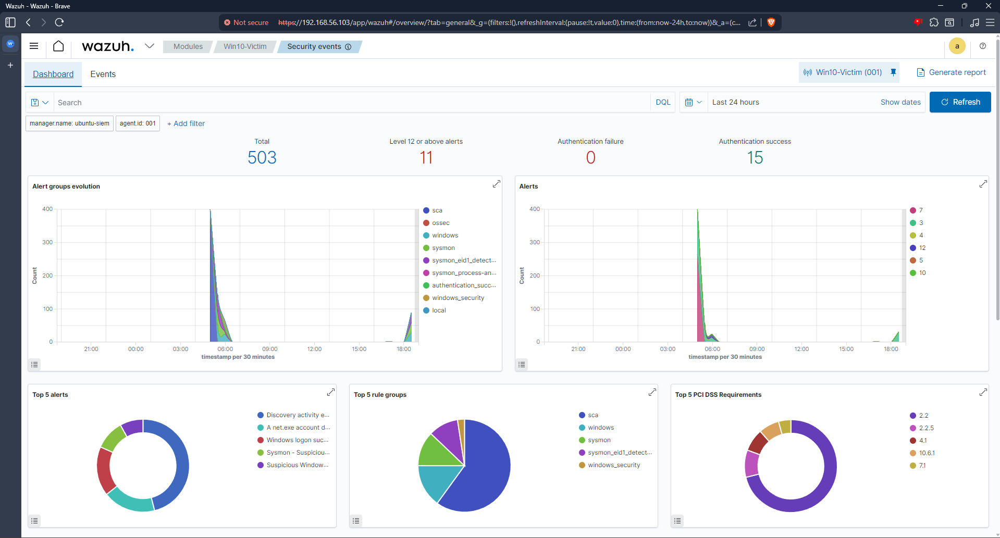
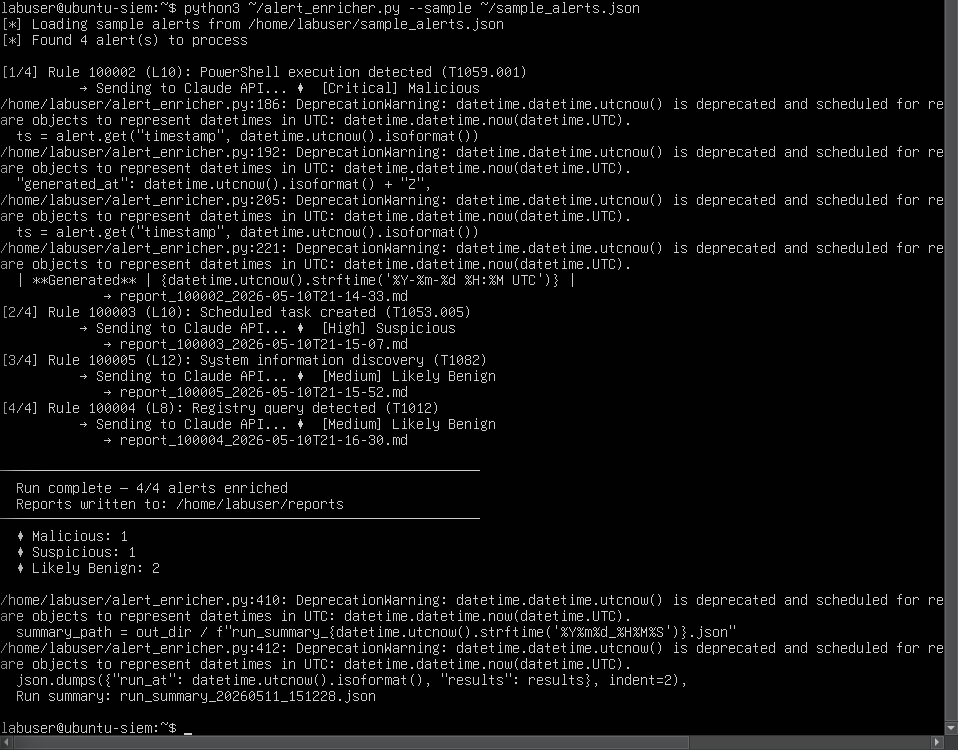

# AI-Assisted SOC Detection Lab

A fully functional home Security Operations Center (SOC) lab that simulates real enterprise security workflows — from attack simulation to AI-powered incident response.

> Built to demonstrate SOC analyst, detection engineering, and security automation skills.

---

## What This Project Does

This lab simulates a realistic enterprise environment where:

1. **Attacks are executed** using Atomic Red Team (MITRE ATT&CK mapped simulations)
2. **Telemetry is collected** via Sysmon on the victim endpoint
3. **Alerts are generated** by a Wazuh SIEM with custom detection rules
4. **AI enrichment runs automatically** — a Python pipeline sends alerts to the Claude API and receives structured investigation reports
5. **Incident reports are generated** with severity ratings, MITRE mappings, investigation steps, and remediation guidance

---

## Architecture

```
Kali Linux VM          →      Windows 10 VM         →      Ubuntu Server VM
192.168.56.101                192.168.56.102                192.168.56.103
[Attacker]           Attack    [Victim Endpoint]    Sysmon    [SIEM + AI Pipeline]
                     Traffic   Sysmon Installed     Events    Wazuh + Python + Claude API
```



**Network:** VirtualBox Host-Only (192.168.56.0/24) for lab traffic + NAT for internet access

---

## Tech Stack

| Component | Tool | Purpose |
|---|---|---|
| Hypervisor | Oracle VirtualBox 7.x | VM management |
| SIEM | Wazuh 4.7.5 | Log collection, alerting, dashboards |
| Endpoint Telemetry | Microsoft Sysmon | Deep Windows event logging |
| Attack Simulation | Atomic Red Team | Safe MITRE ATT&CK mapped simulations |
| AI Enrichment | Anthropic Claude API | Automated alert analysis and reporting |
| Detection Format | Wazuh XML Rules | Custom platform-specific detections |

---

## Attack → Detection → Response: Full Example

### Attack: T1059.001 — PowerShell Encoded Command Execution

**What the attacker does:**
Executes a Base64-encoded PowerShell command with `-ExecutionPolicy Bypass` and `-NonInteractive` flags — a classic technique to evade simple string-based detections and run code without user interaction.

**What Sysmon captures:**
```
EventID=1 (Process Creation)
Image: C:\Windows\System32\WindowsPowerShell\v1.0\powershell.exe
CommandLine: powershell.exe -NoProfile -NonInteractive -ExecutionPolicy Bypass -EncodedCommand JABjAD0ATgBlAHcALQBPAGIAagBl...
ParentImage: C:\Windows\System32\cmd.exe
User: labuser
SHA256: ABC3E2D7F1B94056E2C1A34D78F29B6E5D0C1A2B3E4F5A6B7C8D9E0F1A2B3C4D
```

**What the custom Wazuh rule detects:**
```xml
<rule id="100002" level="10">
  <if_group>sysmon_event1</if_group>
  <field name="win.eventdata.image" type="pcre2">(?i)powershell\.exe</field>
  <description>PowerShell execution detected (T1059.001)</description>
  <mitre><id>T1059.001</id></mitre>
</rule>
```

**What the AI pipeline generates:**

```
Severity:     CRITICAL
MITRE:        T1059.001 — Command and Scripting Interpreter: PowerShell
Confidence:   High
Classification: Malicious

Summary:
Encoded PowerShell execution with ExecutionPolicy Bypass detected on Win10-Victim.
The combination of -NonInteractive, -ExecutionPolicy Bypass, and -EncodedCommand
is characteristic of offensive tooling rather than legitimate administration.

Investigation Steps:
1. Decode the Base64 command to reveal the actual payload
2. Query Sysmon Event ID 3 for network connections made by this process
3. Trace the parent cmd.exe process to identify the initial execution vector
4. Search for Sysmon Event ID 11 (File Created) to identify dropped payloads
5. Review the user labuser's recent activity: RDP logins, email attachments

Containment:
- Isolate Win10-Victim (192.168.56.102) from the network
- Terminate the PowerShell process and any child processes
- Capture memory dump before remediation for forensic analysis
- Preserve full Sysmon and Windows Event logs

False Positive Check:
Legitimate admin scripts rarely combine ExecutionPolicy Bypass with
EncodedCommand and NonInteractive flags simultaneously. This trifecta
specifically evades security controls and is characteristic of offensive tooling.
```

---

## Custom Detection Rules

Located in `detections/local_rules.xml`

| Rule ID | Level | Technique | Description |
|---|---|---|---|
| 100002 | 10 | T1059.001 | PowerShell execution detected |
| 100003 | 10 | T1053.005 | Scheduled task created — possible persistence |
| 100004 | 8 | T1012 | Registry query by reg.exe |
| 100005 | 12 | T1082 | System information discovery via systeminfo.exe |

---

## AI Pipeline

The `automation/alert_enricher.py` script:

1. Reads Wazuh alerts (from API or sample JSON)
2. Extracts: rule ID, description, MITRE technique, agent name, process image, command line, parent process, hashes
3. Sends structured context to Claude API
4. Receives JSON response with severity, classification, investigation steps, remediation
5. Saves enriched JSON + formatted Markdown report per alert
6. Generates a run summary with threat classification breakdown

**Sample run output:**
```
[1/4] Rule 100002 (L10): PowerShell execution detected (T1059.001)
      → Sending to Claude API... ✦ [Critical] Malicious
      → report_100002_2026-05-10T21-14-33.md

[2/4] Rule 100003 (L10): Scheduled task created (T1053.005)
      → Sending to Claude API... ✦ [High] Suspicious
      → report_100003_2026-05-10T21-15-07.md

Run complete — 4/4 alerts enriched
✦ Malicious: 1  ✦ Suspicious: 1  ✦ Likely Benign: 2
```

---

## Attack Simulations Run

### T1082 — System Information Discovery
- Ran `systeminfo.exe` to enumerate OS, hardware, hotfixes, and network configuration
- Sysmon Event ID 1 captured the process creation with full command line
- Custom rule 100005 fired (Level 12)
- **Why defenders detect this:** Sudden systeminfo.exe execution outside of IT management windows

### T1053.005 — Scheduled Task Persistence
- Created two scheduled tasks: `T1053_005_OnLogon` and `T1053_005_OnStartup`
- Sysmon captured `schtasks.exe /create` — common persistence indicator
- Custom rule 100003 fired (Level 10)
- **Blind spot:** Task Scheduler COM object via PowerShell bypasses schtasks.exe entirely

### T1012 — Query Registry
- Queried Run keys, installed software, and system configuration registry hives
- Sysmon captured multiple `reg.exe query` executions
- Custom rule 100004 fired (Level 8)
- **Blind spot:** `Get-ItemProperty` in PowerShell doesn't spawn reg.exe — bypasses this detection

### T1059.001 — PowerShell Encoded Command
- Executed Base64-encoded PowerShell with ExecutionPolicy Bypass
- Sysmon captured full command line including encoded payload
- Custom rule 100002 fired (Level 10) — AI classified as **Critical/Malicious**

---

## Screenshots

| Screenshot | Description |
|---|---|
|  | Wazuh dashboard after installation |
|  | Win10-Victim agent connected and active |
|  | Live Sysmon events in Wazuh |
|  | Dashboard after attack simulations |
|  | Custom rule 100002 firing |
|  | AI enrichment pipeline processing 4 alerts |

---

## Repository Structure

```
ai-soc-detection-lab/
├── README.md
├── docs/
│   ├── architecture.png        ← Network diagram
│   ├── attack-log.md           ← Documented attack techniques
│   └── project-summary.md      ← Full project documentation
├── detections/
│   └── local_rules.xml         ← Custom Wazuh detection rules
├── automation/
│   └── alert_enricher.py       ← AI enrichment pipeline
├── reports/
│   ├── enriched_*.json         ← Raw AI analysis output
│   ├── report_*.md             ← Formatted incident reports
│   └── timeline-*.md           ← Attack timelines
├── screenshots/                ← Lab evidence
└── sample-logs/
    └── sample_alerts.json      ← Sample Wazuh alerts for testing
```

---

## Key Lessons Learned

**Telemetry is everything.** Sysmon transforms basic Windows logging into a forensic-grade record of every process, network connection, and file operation. Without it, most of these attacks would be invisible to the SIEM.

**Detection engineering is harder than it looks.** Writing rules that load correctly, match the right events, and avoid false positives requires deep understanding of both the log format and attacker behavior.

**AI enrichment adds real value.** The Claude API didn't just classify alerts — it identified that the specific combination of PowerShell flags was characteristic of offensive tooling, provided context-specific investigation steps, and suggested forensic preservation actions. This is the difference between an alert and an investigation.

**Configuration management matters.** Nearly every issue in this lab came from a misconfiguration, not a software bug. Backup config files before editing. Validate XML before restarting services.

---

## Future Expansion

- [ ] Add Active Directory environment for lateral movement detection
- [ ] Integrate Velociraptor for live forensics
- [ ] Add Zeek for network traffic analysis
- [ ] Build SOAR-style automated response actions
- [ ] Add cloud attack simulations (AWS/Azure)
- [ ] Integrate threat hunting dashboards

---

## Tools & References

- [Wazuh Documentation](https://documentation.wazuh.com)
- [Atomic Red Team](https://github.com/redcanaryco/invoke-atomicredteam)
- [MITRE ATT&CK Framework](https://attack.mitre.org)
- [Sysmon by Sysinternals](https://docs.microsoft.com/en-us/sysinternals/downloads/sysmon)
- [Anthropic Claude API](https://docs.anthropic.com)

---

*Built as a portfolio demonstration of SOC analyst, detection engineering, and security automation skills.*
